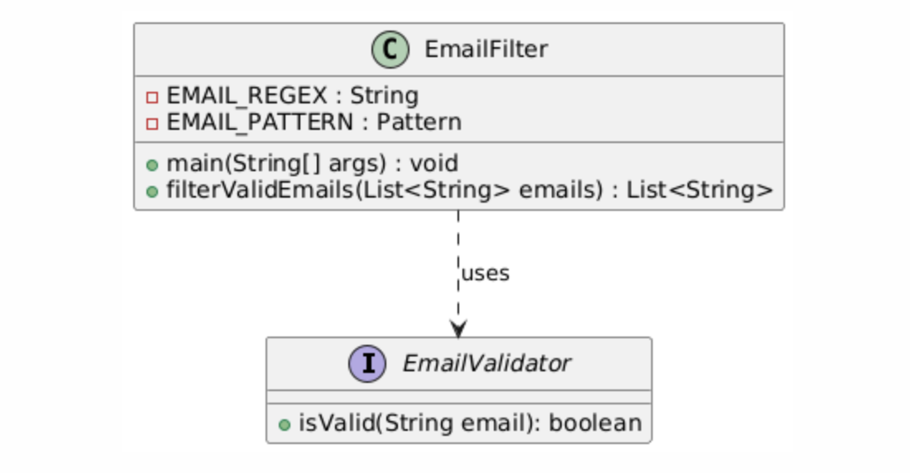
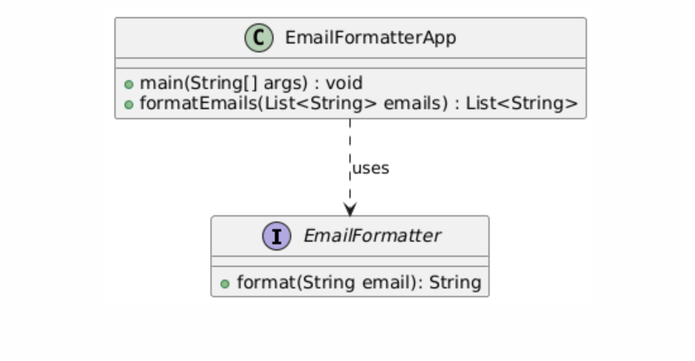
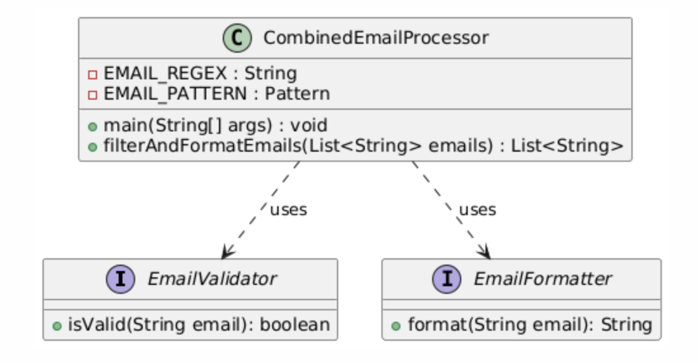

= Java Übungen mit Regular Expressions, Lambda Expressions und Functional Interfaces
Hanan Mehic
2024-10-27

== Einführung
Diese Datei enthält drei Java-Übungen für Anfänger, die Regular Expressions, Lambda Expressions und Functional Interfaces kombinieren. Ziel der Aufgaben ist es, das Verständnis dieser Konzepte in praktischen Szenarien zu vertiefen.

== Übung 1: E-Mail-Filter und -Validator

Erstelle ein Java-Programm, das eine Liste von E-Mail-Adressen verarbeitet und nur gültige E-Mail-Adressen in die Konsole ausgibt.

.Gegeben:
* Eine Liste von E-Mail-Adressen als `List<String>`.
* Ein regulärer Ausdruck zur Überprüfung der E-Mail-Gültigkeit (zum Beispiel: `^[A-Za-z0-9+_.-]+@[A-Za-z0-9.-]+$`).

.Anforderungen:
* Verwende eine Lambda Expression, um eine Methode zum Filtern der E-Mail-Adressen zu erstellen.
* Erstelle ein Functional Interface `EmailValidator` mit einer Methode `boolean isValid(String email)`, das die Validierung übernimmt.
* Filtere die Liste so, dass nur gültige E-Mail-Adressen ausgegeben werden.

== Übung 2: E-Mail-Formatierung mit Functional Interface

Schreibe ein Java-Programm, das E-Mail-Adressen in Kleinbuchstaben umwandelt und anschließend ausgibt.

.Gegeben:
* Eine Liste von E-Mail-Adressen als `List<String>`.

.Anforderungen:
* Definiere ein Functional Interface `EmailFormatter` mit einer Methode `String format(String email)`, die das Formatieren der E-Mail-Adresse übernimmt.
* Verwende eine Lambda Expression, um die E-Mail-Adressen in Kleinbuchstaben umzuwandeln.
* Gib die formatierten E-Mail-Adressen in der Konsole aus.

== Übung 3: E-Mail-Filter und -Formatierer kombiniert

Erstelle ein Java-Programm, das E-Mail-Adressen zuerst filtert und dann formatiert.

.Gegeben:
* Eine Liste von E-Mail-Adressen als `List<String>`.
* Ein regulärer Ausdruck zur Überprüfung der E-Mail-Gültigkeit.

.Anforderungen:
* Definiere zwei Functional Interfaces: `EmailValidator` mit einer Methode `boolean isValid(String email)` und `EmailFormatter` mit einer Methode `String format(String email)`.
* Verwende eine Lambda Expression, um die Liste nach gültigen E-Mail-Adressen zu filtern.
* Verwende eine zweite Lambda Expression, um die E-Mail-Adressen in Kleinbuchstaben umzuwandeln.
* Gib die gültigen, formatierten E-Mail-Adressen in der Konsole aus.

